# Lalitha Mega Mall - Complete Workflows Guide

## 📋 Table of Contents
- [User Authentication Workflows](#user-authentication-workflows)
- [Shopping Cart Workflows](#shopping-cart-workflows)
- [Order Management Workflows](#order-management-workflows)
- [Payment Processing Workflows](#payment-processing-workflows)
- [Product Management Workflows](#product-management-workflows)
- [Admin Panel Workflows](#admin-panel-workflows)
- [Wishlist Management Workflows](#wishlist-management-workflows)
- [Image Upload Workflows](#image-upload-workflows)
- [Error Handling Workflows](#error-handling-workflows)
- [State Management Workflows](#state-management-workflows)
- [API Integration Workflows](#api-integration-workflows)
- [Development Workflows](#development-workflows)
- [Deployment Workflows](#deployment-workflows)

---

## 🔐 User Authentication Workflows

### 1. User Registration Workflow
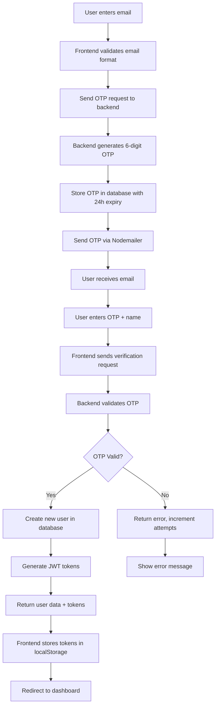

**Technical Implementation:**
- **Frontend**: `Frontend/src/api/authApi.ts` - `sendOtp()`, `verifyOtp()`
- **Backend**: `backend/controllers/authController.js` - `sendOtpToEmail()`, `verifyOtpAndLogin()`
- **Database**: `otps` table for temporary OTP storage
- **Email**: Nodemailer with Gmail SMTP

**Key Features:**
- Email format validation
- OTP expiry (24 hours)
- Attempt limiting (max 3 attempts)
- Automatic user creation on first login
- JWT token generation and storage

### 2. User Login Workflow
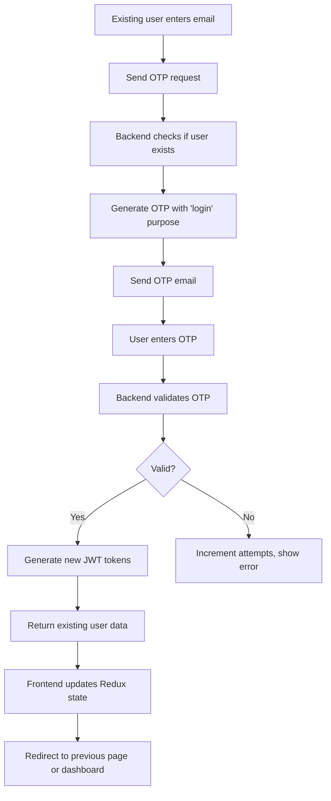

### 3. Token Refresh Workflow
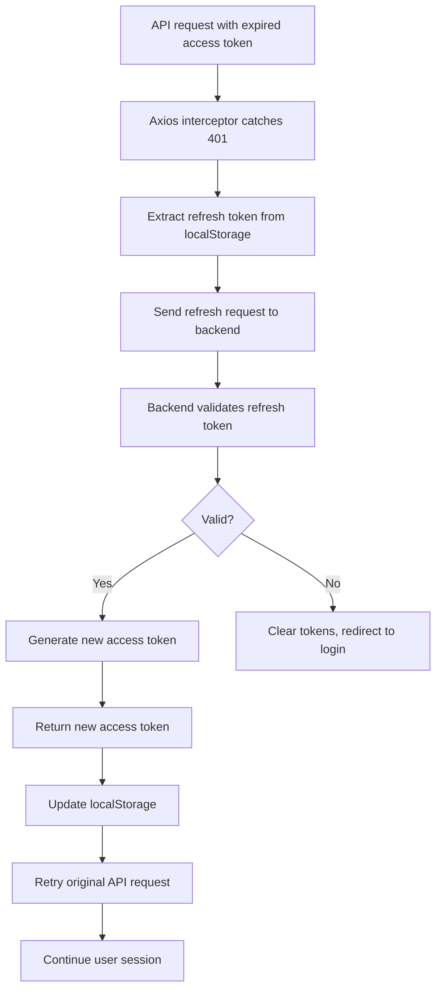

---

## 🛒 Shopping Cart Workflows

### 1. Guest Cart Workflow
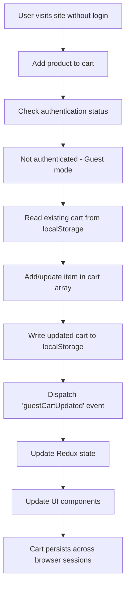

**Technical Implementation:**
- **Storage**: `localStorage('guestCart')`
- **Structure**: Array of cart items with product snapshots
- **Sync**: Custom event broadcasting for cross-tab updates
- **Persistence**: Survives browser refresh and reopening

### 2. Authenticated Cart Workflow
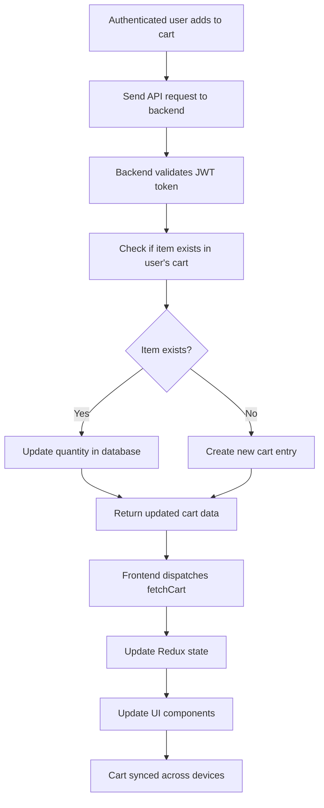

### 3. Guest-to-Auth Cart Sync Workflow
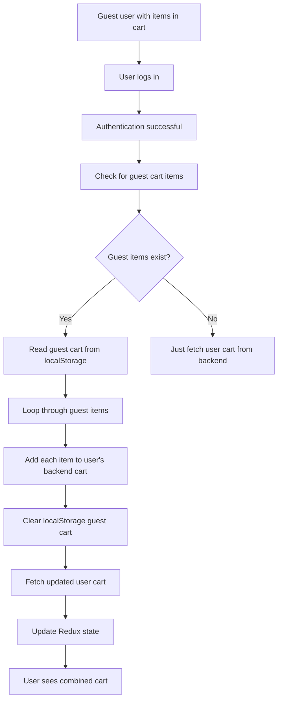

### 4. Cart Operations Workflow
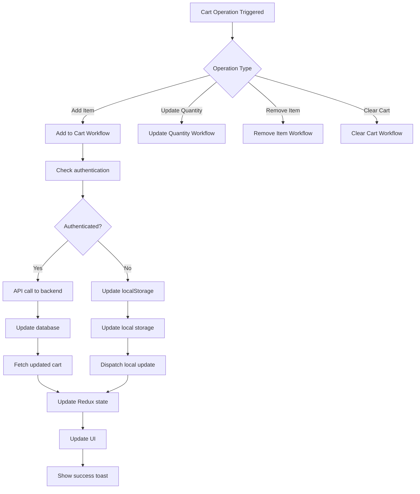

---

## 📦 Order Management Workflows

### 1. Order Creation Workflow
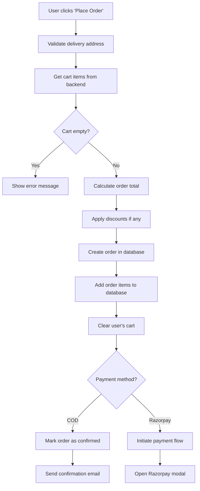

### 2. Order Status Update Workflow
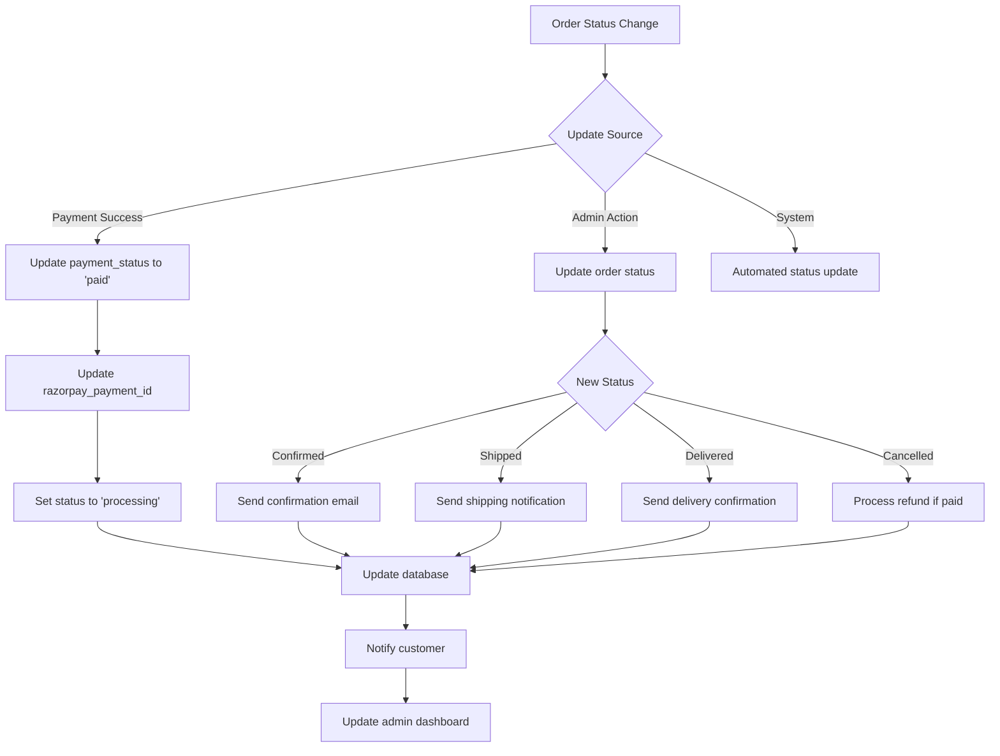

### 3. Order Tracking Workflow
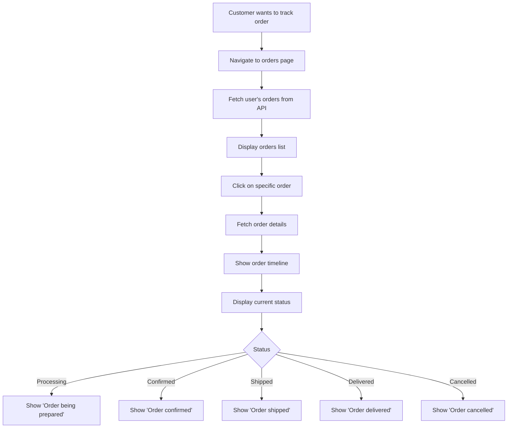

---

## 💳 Payment Processing Workflows

### 1. Razorpay Payment Workflow
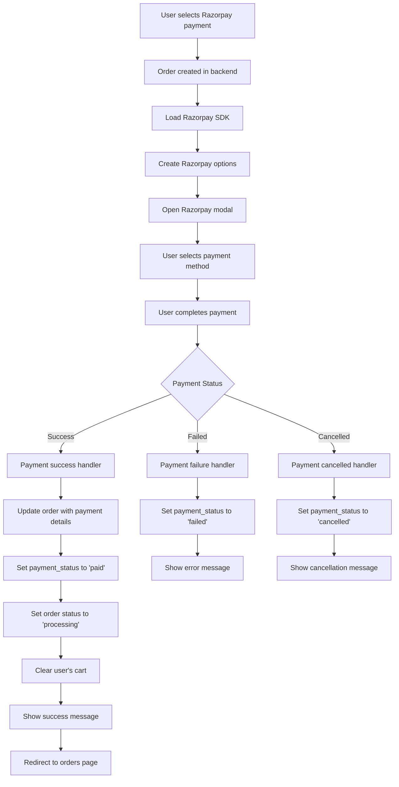

### 2. Cash on Delivery Workflow
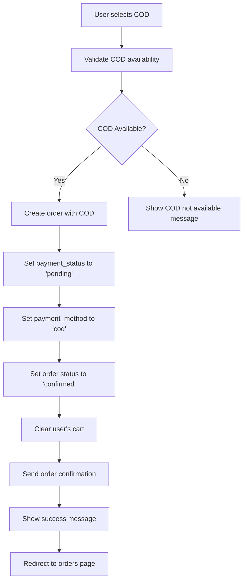

### 3. Payment Verification Workflow
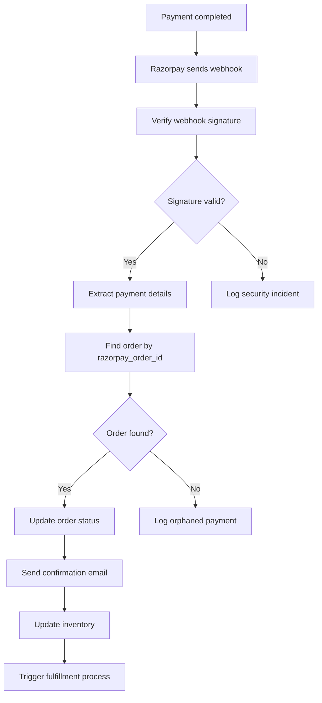

---

## 🏪 Product Management Workflows

### 1. Product Creation Workflow (Admin)
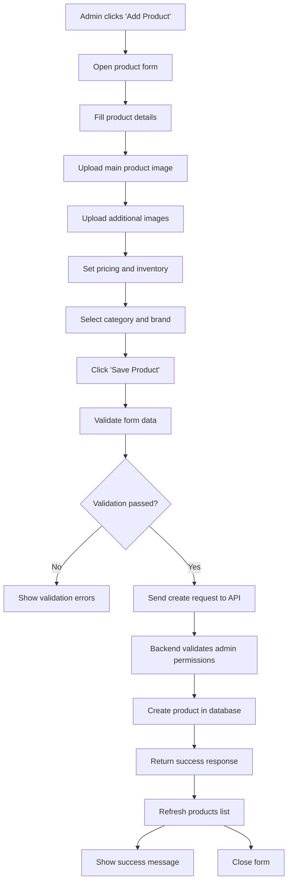

### 2. Image Upload Workflow
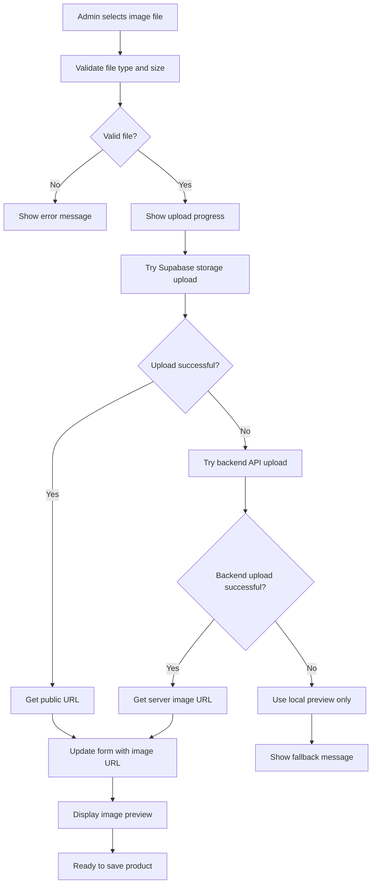

### 3. Product Search and Filter Workflow
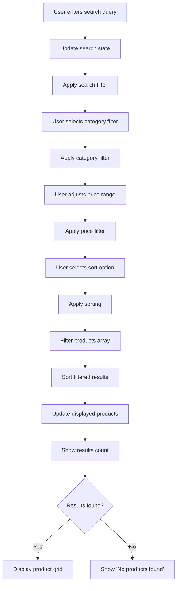

---

## 👨‍💼 Admin Panel Workflows

### 1. Admin Authentication Workflow
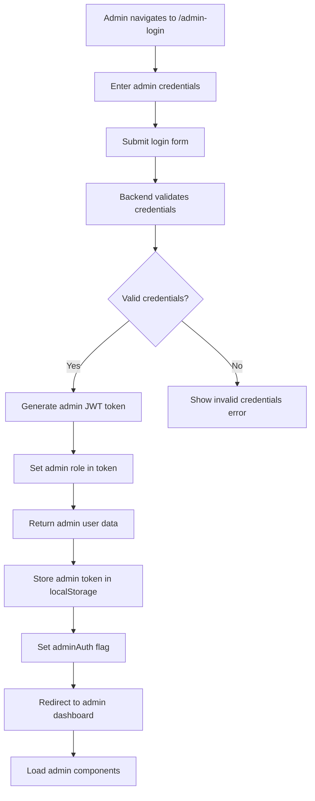

### 2. Admin Dashboard Workflow
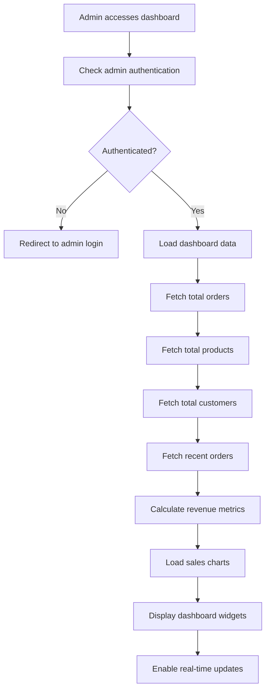

### 3. Order Management Workflow (Admin)
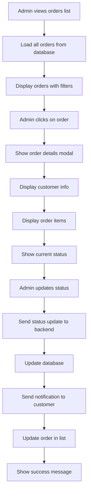

---

## ❤️ Wishlist Management Workflows

### 1. Add to Wishlist Workflow
```mermaid
graph TD
    A[User clicks wishlist icon] --> B[Check authentication]
    B --> C{Authenticated?}
    C -->|No| D[Show login required message]
    C -->|Yes| E[Send add to wishlist request]
    E --> F[Backend checks if item exists]
    F --> G{Item already in wishlist?}
    G -->|Yes| H[Show 'already in wishlist' message]
    G -->|No| I[Add item to wishlist table]
    I --> J[Return success response]
    J --> K[Update Redux wishlist state]
    K --> L[Update UI (fill heart icon)]
    L --> M[Show success toast]
```

### 2. Remove from Wishlist Workflow
```mermaid
graph TD
    A[User clicks filled wishlist icon] --> B[Send remove request to backend]
    B --> C[Find wishlist item by product_id]
    C --> D{Item found?}
    D -->|No| E[Return not found error]
    D -->|Yes| F[Delete from wishlist table]
    F --> G[Return success response]
    G --> H[Update Redux state]
    H --> I[Update UI (empty heart icon)]
    I --> J[Show removal toast]
```

### 3. Wishlist Page Workflow
```mermaid
graph TD
    A[User navigates to wishlist page] --> B[Check authentication]
    B --> C{Authenticated?}
    C -->|No| D[Show login prompt]
    C -->|Yes| E[Fetch wishlist items]
    E --> F[Load product details for each item]
    F --> G{Items found?}
    G -->|No| H[Show empty wishlist message]
    G -->|Yes| I[Display wishlist grid]
    I --> J[Enable add to cart from wishlist]
    J --> K[Enable remove from wishlist]
    K --> L[Show wishlist actions]
```

---

## 📸 Image Upload Workflows

### 1. Supabase Storage Upload Workflow
```mermaid
graph TD
    A[User selects image file] --> B[Validate file type and size]
    B --> C[Generate unique filename]
    C --> D[Convert file to ArrayBuffer]
    D --> E[Upload to Supabase storage]
    E --> F{Upload successful?}
    F -->|Yes| G[Get public URL]
    F -->|No| H[Try backend fallback]
    G --> I[Update form with URL]
    I --> J[Show success message]
    I --> K[Display image preview]
```

### 2. Backend API Upload Workflow
```mermaid
graph TD
    A[Supabase upload failed] --> B[Create FormData with file]
    B --> C[Send to backend upload API]
    C --> D[Backend validates file]
    D --> E[Save file to server directory]
    E --> F[Generate server URL]
    F --> G[Return image URL]
    G --> H[Update form with server URL]
    H --> I[Show upload success]
```

### 3. Image Preview Workflow
```mermaid
graph TD
    A[Image uploaded successfully] --> B[Get image URL]
    B --> C[Create image preview element]
    C --> D[Set preview source]
    D --> E[Display preview with controls]
    E --> F[Add remove button]
    F --> G[Add replace option]
    G --> H[Update form state]
    H --> I[Enable save product]
```

---

## ⚠️ Error Handling Workflows

### 1. API Error Handling Workflow
```mermaid
graph TD
    A[API request fails] --> B[Axios interceptor catches error]
    B --> C{Error type?}
    C -->|401 Unauthorized| D[Try token refresh]
    C -->|403 Forbidden| E[Show access denied]
    C -->|404 Not Found| F[Show not found message]
    C -->|500 Server Error| G[Show server error]
    C -->|Network Error| H[Show network error]
    
    D --> I{Refresh successful?}
    I -->|Yes| J[Retry original request]
    I -->|No| K[Logout user]
    
    E --> L[Log security incident]
    F --> M[Suggest alternative action]
    G --> N[Log error details]
    H --> O[Show retry option]
```

### 2. Form Validation Workflow
```mermaid
graph TD
    A[User submits form] --> B[Run client-side validation]
    B --> C{Validation passed?}
    C -->|No| D[Show validation errors]
    C -->|Yes| E[Send to backend]
    E --> F[Backend validates data]
    F --> G{Backend validation passed?}
    G -->|No| H[Return validation errors]
    G -->|Yes| I[Process request]
    H --> J[Display backend errors]
    I --> K[Return success response]
    K --> L[Show success message]
```

### 3. Network Error Recovery Workflow
```mermaid
graph TD
    A[Network request fails] --> B[Check error type]
    B --> C{Error type?}
    C -->|Timeout| D[Show retry option]
    C -->|No Internet| E[Show offline message]
    C -->|Server Down| F[Show maintenance message]
    
    D --> G[User clicks retry]
    G --> H[Retry request with backoff]
    
    E --> I[Enable offline mode]
    I --> J[Cache user actions]
    J --> K[Sync when online]
    
    F --> L[Show estimated downtime]
    L --> M[Enable status page link]
```

---

## 🔄 State Management Workflows

### 1. Redux Store Initialization Workflow
```mermaid
graph TD
    A[App starts] --> B[Initialize Redux store]
    B --> C[Load persisted state]
    C --> D[Check authentication status]
    D --> E{User authenticated?}
    E -->|Yes| F[Load user data]
    E -->|No| G[Set guest mode]
    F --> H[Fetch user cart]
    F --> I[Fetch user wishlist]
    G --> J[Load guest cart from localStorage]
    H --> K[Update cart state]
    I --> L[Update wishlist state]
    J --> K
    K --> M[App ready]
```

### 2. State Synchronization Workflow
```mermaid
graph TD
    A[User action triggers state change] --> B[Dispatch Redux action]
    B --> C[Action reaches reducer]
    C --> D[Update state immutably]
    D --> E[Notify connected components]
    E --> F[Components re-render]
    F --> G[Update localStorage if needed]
    G --> H[Broadcast events if needed]
    H --> I[Sync across browser tabs]
```

### 3. Authentication State Workflow
```mermaid
graph TD
    A[Authentication event] --> B{Event type?}
    B -->|Login| C[Set user data in state]
    B -->|Logout| D[Clear user data]
    B -->|Token refresh| E[Update tokens]
    
    C --> F[Set isAuthenticated to true]
    F --> G[Sync guest cart to user cart]
    G --> H[Fetch user wishlist]
    
    D --> I[Set isAuthenticated to false]
    I --> J[Clear cart and wishlist]
    J --> K[Clear localStorage tokens]
    
    E --> L[Update stored tokens]
    L --> M[Continue user session]
```

---

## 🔌 API Integration Workflows

### 1. API Request Lifecycle
```mermaid
graph TD
    A[Component needs data] --> B[Dispatch async thunk]
    B --> C[Thunk creates API request]
    C --> D[Axios interceptor adds auth header]
    D --> E[Send request to backend]
    E --> F[Backend processes request]
    F --> G{Request successful?}
    G -->|Yes| H[Return data]
    G -->|No| I[Return error]
    H --> J[Thunk fulfilled]
    I --> K[Thunk rejected]
    J --> L[Update Redux state with data]
    K --> M[Update Redux state with error]
    L --> N[Component re-renders with data]
    M --> O[Component shows error state]
```

### 2. Authentication Header Workflow
```mermaid
graph TD
    A[API request initiated] --> B[Axios request interceptor]
    B --> C[Check for access token]
    C --> D{Token exists?}
    D -->|Yes| E[Add Authorization header]
    D -->|No| F[Send request without auth]
    E --> G[Send authenticated request]
    F --> H[Send public request]
    G --> I[Backend validates token]
    H --> J[Backend processes public request]
    I --> K{Token valid?}
    K -->|Yes| L[Process authenticated request]
    K -->|No| M[Return 401 Unauthorized]
```

### 3. Response Handling Workflow
```mermaid
graph TD
    A[API response received] --> B[Axios response interceptor]
    B --> C{Response status?}
    C -->|200-299| D[Return response data]
    C -->|401| E[Try token refresh]
    C -->|403| F[Handle forbidden]
    C -->|404| G[Handle not found]
    C -->|500+| H[Handle server error]
    
    E --> I{Refresh successful?}
    I -->|Yes| J[Retry original request]
    I -->|No| K[Logout user]
    
    D --> L[Update component state]
    F --> M[Show access denied message]
    G --> N[Show not found message]
    H --> O[Show server error message]
```

---

## 🛠️ Development Workflows

### 1. Feature Development Workflow
```mermaid
graph TD
    A[New feature request] --> B[Create feature branch]
    B --> C[Design API endpoints]
    C --> D[Implement backend logic]
    D --> E[Create database migrations]
    E --> F[Implement frontend components]
    F --> G[Add Redux state management]
    G --> H[Write unit tests]
    H --> I[Write integration tests]
    I --> J[Test manually]
    J --> K[Code review]
    K --> L{Review approved?}
    L -->|No| M[Address feedback]
    L -->|Yes| N[Merge to main]
    M --> K
    N --> O[Deploy to staging]
    O --> P[QA testing]
    P --> Q[Deploy to production]
```

### 2. Bug Fix Workflow
```mermaid
graph TD
    A[Bug reported] --> B[Reproduce bug]
    B --> C[Identify root cause]
    C --> D[Create hotfix branch]
    D --> E[Implement fix]
    E --> F[Write regression test]
    F --> G[Test fix locally]
    G --> H[Code review]
    H --> I[Merge to main]
    I --> J[Deploy hotfix]
    J --> K[Verify fix in production]
    K --> L[Update bug report]
```

### 3. Code Quality Workflow
```mermaid
graph TD
    A[Code committed] --> B[Pre-commit hooks run]
    B --> C[ESLint checks code style]
    C --> D[TypeScript checks types]
    D --> E[Prettier formats code]
    E --> F{All checks pass?}
    F -->|No| G[Show errors to developer]
    F -->|Yes| H[Allow commit]
    G --> I[Fix issues]
    I --> B
    H --> J[Push to repository]
    J --> K[CI/CD pipeline runs]
    K --> L[Run automated tests]
    L --> M[Build application]
    M --> N[Deploy if tests pass]
```

---

## 🚀 Deployment Workflows

### 1. Frontend Deployment Workflow (Vercel)
```mermaid
graph TD
    A[Code pushed to main branch] --> B[Vercel detects changes]
    B --> C[Clone repository]
    C --> D[Install dependencies]
    D --> E[Run build process]
    E --> F[Generate static files]
    F --> G[Deploy to CDN]
    G --> H[Update DNS]
    H --> I[Run health checks]
    I --> J{Deployment successful?}
    J -->|Yes| K[Update production URL]
    J -->|No| L[Rollback to previous version]
    K --> M[Send deployment notification]
    L --> N[Send failure notification]
```

### 2. Backend Deployment Workflow (Railway/Heroku)
```mermaid
graph TD
    A[Backend code pushed] --> B[Platform detects changes]
    B --> C[Build Docker container]
    C --> D[Install Node.js dependencies]
    D --> E[Run database migrations]
    E --> F[Start application server]
    F --> G[Health check endpoint]
    G --> H{Server healthy?}
    H -->|Yes| I[Route traffic to new instance]
    H -->|No| J[Keep old instance running]
    I --> K[Terminate old instance]
    J --> L[Debug deployment issues]
    K --> M[Deployment complete]
```

### 3. Database Migration Workflow
```mermaid
graph TD
    A[Schema changes needed] --> B[Create migration script]
    B --> C[Test migration on staging]
    C --> D[Backup production database]
    D --> E[Run migration on production]
    E --> F{Migration successful?}
    F -->|Yes| G[Update application code]
    F -->|No| H[Rollback database]
    G --> I[Deploy new application version]
    H --> J[Restore from backup]
    I --> K[Verify application works]
    J --> L[Investigate migration failure]
    K --> M[Migration complete]
```

---

## 📊 Monitoring and Analytics Workflows

### 1. Error Monitoring Workflow
```mermaid
graph TD
    A[Error occurs in application] --> B[Error caught by error boundary]
    B --> C[Log error details]
    C --> D[Send error to monitoring service]
    D --> E[Categorize error type]
    E --> F[Check error frequency]
    F --> G{Critical error?}
    G -->|Yes| H[Send immediate alert]
    G -->|No| I[Add to error dashboard]
    H --> J[Notify development team]
    I --> K[Track error trends]
    J --> L[Investigate and fix]
    K --> M[Weekly error review]
```

### 2. Performance Monitoring Workflow
```mermaid
graph TD
    A[User visits application] --> B[Collect performance metrics]
    B --> C[Measure page load time]
    C --> D[Track API response times]
    D --> E[Monitor resource usage]
    E --> F[Send metrics to analytics]
    F --> G[Generate performance reports]
    G --> H{Performance degraded?}
    H -->|Yes| I[Alert development team]
    H -->|No| J[Continue monitoring]
    I --> K[Investigate bottlenecks]
    J --> L[Archive metrics]
    K --> M[Optimize performance]
```

### 3. User Analytics Workflow
```mermaid
graph TD
    A[User interacts with app] --> B[Track user actions]
    B --> C[Record page views]
    C --> D[Track conversion events]
    D --> E[Monitor user flows]
    E --> F[Send data to analytics platform]
    F --> G[Generate user insights]
    G --> H[Create usage reports]
    H --> I[Identify improvement opportunities]
    I --> J[Plan feature enhancements]
    J --> K[A/B test new features]
    K --> L[Measure impact]
```

---

## 🔒 Security Workflows

### 1. Authentication Security Workflow
```mermaid
graph TD
    A[User attempts login] --> B[Rate limit check]
    B --> C{Too many attempts?}
    C -->|Yes| D[Block IP temporarily]
    C -->|No| E[Validate credentials]
    D --> F[Log security incident]
    E --> G{Valid credentials?}
    G -->|No| H[Increment failed attempts]
    G -->|Yes| I[Generate secure JWT]
    H --> J[Log failed attempt]
    I --> K[Set secure headers]
    K --> L[Return token to client]
    L --> M[Store token securely]
```

### 2. Data Validation Workflow
```mermaid
graph TD
    A[Data received from client] --> B[Validate input format]
    B --> C[Sanitize input data]
    C --> D[Check data types]
    D --> E[Validate business rules]
    E --> F{All validations pass?}
    F -->|No| G[Return validation errors]
    F -->|Yes| H[Process request]
    G --> I[Log validation failure]
    H --> J[Execute business logic]
    I --> K[Send error response]
    J --> L[Return success response]
```

### 3. API Security Workflow
```mermaid
graph TD
    A[API request received] --> B[Check rate limits]
    B --> C[Validate JWT token]
    C --> D[Check user permissions]
    D --> E[Validate request data]
    E --> F{All security checks pass?}
    F -->|No| G[Return security error]
    F -->|Yes| H[Process request]
    G --> I[Log security violation]
    H --> J[Execute API logic]
    I --> K[Block suspicious activity]
    J --> L[Return API response]
```

---

## 📱 Mobile Responsiveness Workflow

### 1. Responsive Design Workflow
```mermaid
graph TD
    A[Design component] --> B[Define breakpoints]
    B --> C[Mobile-first approach]
    C --> D[Implement base mobile styles]
    D --> E[Add tablet styles]
    E --> F[Add desktop styles]
    F --> G[Test on different devices]
    G --> H{Responsive working?}
    H -->|No| I[Adjust styles]
    H -->|Yes| J[Optimize performance]
    I --> G
    J --> K[Test touch interactions]
    K --> L[Validate accessibility]
    L --> M[Deploy responsive component]
```

---

## 🔄 Data Synchronization Workflows

### 1. Real-time Data Sync Workflow
```mermaid
graph TD
    A[Data changes in database] --> B[Trigger change event]
    B --> C[Identify affected users]
    C --> D[Send real-time updates]
    D --> E[Client receives update]
    E --> F[Update local state]
    F --> G[Re-render components]
    G --> H[Show updated data to user]
```

### 2. Offline Data Sync Workflow
```mermaid
graph TD
    A[User goes offline] --> B[Detect network status]
    B --> C[Enable offline mode]
    C --> D[Cache user actions]
    D --> E[Store in local storage]
    E --> F[User comes back online]
    F --> G[Detect network restoration]
    G --> H[Sync cached actions]
    H --> I[Update server data]
    I --> J[Resolve conflicts]
    J --> K[Update local state]
    K --> L[Notify user of sync]
```

---

*This comprehensive workflows guide covers all major processes in the Lalitha Mega Mall e-commerce platform. Each workflow includes technical implementation details, decision points, error handling, and integration touchpoints.*

**Last Updated**: December 2024  
**Version**: 1.0.0  
**Status**: Production Ready ✅